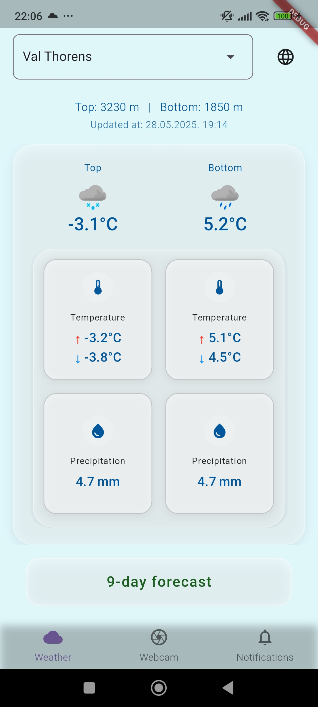
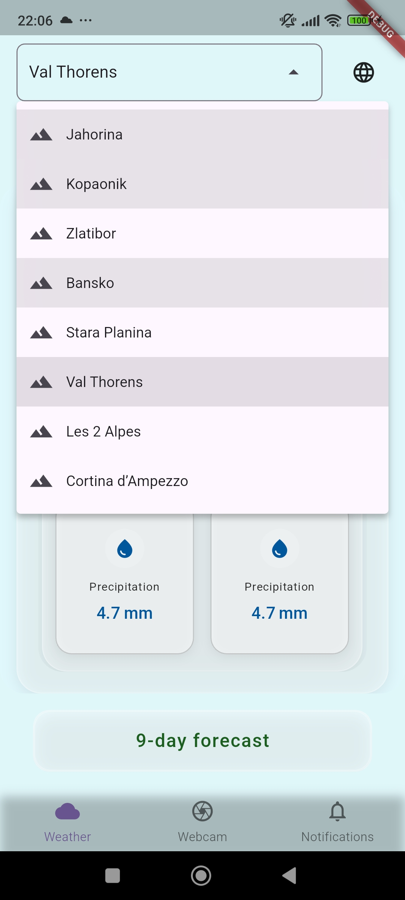
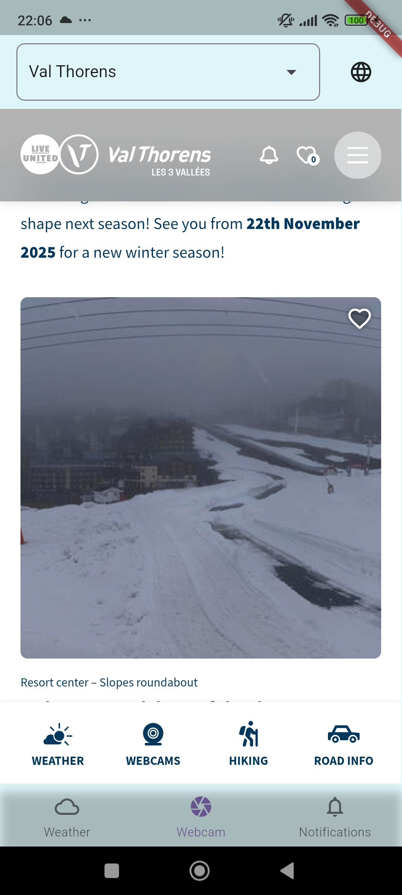
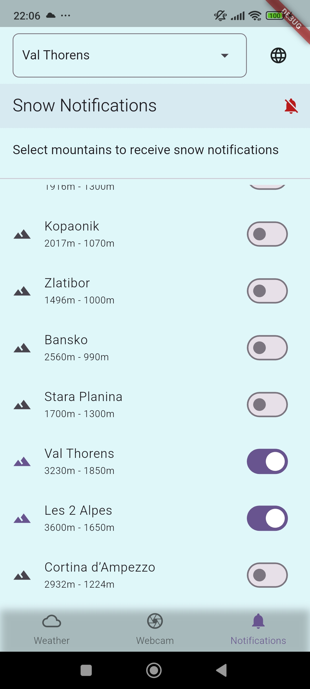
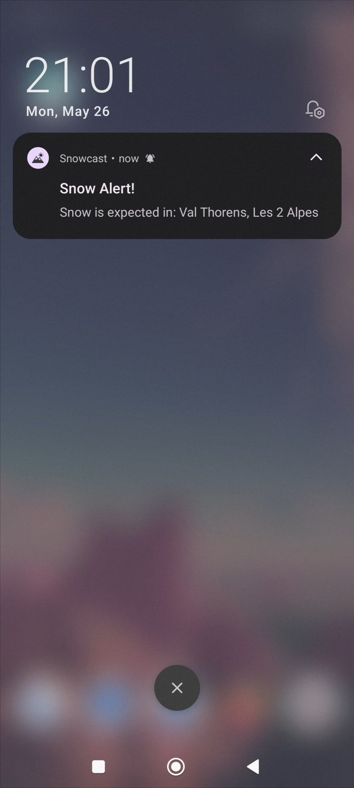

# Snowcast

Snowcast sends snowfall notifications 9 days in advance, so you can plan your trips early. View live webcams from multiple mountains and check detailed weather data of mountains like top and bottom temperatures, snow accumulation, and fog.

## Features

- **Snow Notifications**
  - Get weather notifications up to 9 days in advance
  - Plan your ski trips early with accurate weather forecasts
  - Customize notification preferences for different mountain locations

- **Weather Information**
  - Real-time weather data for both top and bottom altitudes of mountains
  - Detailed weather metrics including temperature, precipitation, wind speed, UV index, and fog conditions
  - Weather status indicators with appropriate color coding
  - Dynamic gradient backgrounds that change based on weather conditions (snowy weather shows white gradients, sunny weather shows blue gradients, etc.)

- **Mountain Selection**
  - Dropdown menu for selecting different mountain locations
  - Automatic weather updates when changing locations

- **Webcam Integration**
  - Live webcam feeds from selected mountain locations
  - Loading and error states for webcam streams

## Screenshots
<table>
  <tr>
    <td align="center">
      
      <br>
      <b>Weather Page</b>
    </td>
    <td align="center">
      
      <br>
      <b>Mountain Selection</b>
    </td>
    <td align="center">
      
      <br>
      <b>Webcam Page</b>
    </td>
    <td align="center">
      
      <br>
      <b>Snow Notifications Page</b>
    </td>
    <td align="center">
      
      <br>
      <b>Snow Alert</b>
    </td>
  </tr>
</table>

## Project Structure

```
lib/
├── core/                 # Core functionality and utilities
│   ├── app/            # App-wide configurations and setup
│   ├── di/             # Dependency injection
│   ├── error/          # Error handling and custom exceptions
│   ├── extensions/     # Dart extensions
│   ├── navigation/     # Navigation components
│   ├── router/         # Route configuration
│   ├── services/       # Core services
│   ├── theme/          # App theming and styling
│   ├── utils/          # Utility functions and helpers
│   └── widget/         # Reusable widgets
├── features/           # Feature modules
│   ├── localization/   # Language selection and management
│   ├── mountain_selector/  # Mountain selection functionality
│   ├── weather/        # Weather information feature
│   ├── webcam/         # Webcam integration
│   └── snow_notifications/ # Snow condition notifications
├── l10n/              # Localization
│   ├── app_en.arb     # English translations
│   └── app_sr.arb     # Serbian translations
└── main.dart          # Application entry point
```

## Features in Detail

### Localization
- Full support for English and Serbian languages
- Automatic language detection based on device settings
- Easy to add more languages in the future

### Dynamic Weather UI
- Beautiful gradient backgrounds that adapt to current weather conditions
- Snowy conditions: White and light blue gradients
- Sunny conditions: Blue and light yellow gradients
- Rainy conditions: Dark blue and gray gradients
- Cloudy conditions: Gray and light blue gradients

### Snow Notifications
- Receive notifications up to 9 days before your planned ski trip
- Get alerts for snowfall predictions
- Customize notification preferences for each mountain

## Getting Started

### Prerequisites

- Flutter SDK (^3.5.0)
- Dart SDK (^3.5.0)

### Installation

1. Clone the repository:
   ```bash
   git clone https://github.com/yourusername/snowcast.git
   ```

2. Navigate to the project directory:
   ```bash
   cd snowcast
   ```

3. Install dependencies:
   ```bash
   flutter pub get
   ```

4. Create a `.env` file in the root directory with your API keys and configuration.

5. Run the app:
   ```bash
   flutter run
   ```

## Dependencies

- **State Management**: `flutter_bloc`
- **Routing**: `go_router`
- **Environment Variables**: `flutter_dotenv`
- **Web Integration**: `flutter_inappwebview`
- **HTTP Client**: `http`
- **Code Generation**: `freezed`, `build_runner`

## Development

### Code Generation

Run the following command to generate code:
```bash
dart run build_runner build --delete-conflicting-outputs
```

### App Icons

To update app icons:
```bash
flutter pub run flutter_launcher_icons
```

## Acknowledgments

- Weather data provided by [MET Norway](https://api.met.no/)
- Webcam feeds provided by:
  - Jahorina: [jahorina.org](https://www.jahorina.org)
  - Kopaonik: [infokop.net](https://m.infokop.net)
  - Zlatibor: [uzivokamere.com](https://uzivokamere.com)
  - Bansko: [banskoski.com](https://www.banskoski.com)
  - Stara Planina: [skiresort.info](https://www.skiresort.info)
  - Val Thorens: [valthorens.com](https://www.valthorens.com)
  - Les 2 Alpes: [les2alpes.com](https://www.les2alpes.com)
  - Cortina d'Ampezzo: [dolomitisuperski.com](https://www.dolomitisuperski.com)
